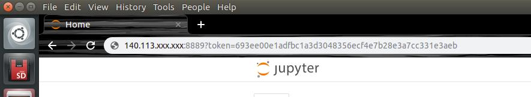

# trailnet-pytorch
This repo is created for re-producing Pytorch TrailNet of [deep trail following](https://www.youtube.com/watch?v=JoLgCwoSRd8) which was published in ICRA2018.

### Prerequisite
 1. OS: Ubuntu 16.04/18.04
 2. GPU with Nvidia driver >= 384.xx (supprt cuda9.0 or newer)
 3. [Docker](https://docs.docker.com/install/linux/docker-ce/ubuntu/)
 4. [nvidia-docker2 (older version)](https://github.com/NVIDIA/nvidia-docker#upgrading-with-nvidia-docker2-deprecated)

### Test
```bash
$ cd trailnet-pytorch
$ source docker_run.sh [cuda9 | cuda10]     # Depend on your nvidia-driver version

# In the docker container
$ source jupyter_run_no_browser.sh
```

The jupyter token will be shown in the terminal. Please copy the text after the IP info, like '?8889?/token=aabbcc009966...' Open the browser, type your GPU machine's IP and paste the token info. the sample result is shown below.
 

Choose **trailnet-pytorch-evaluation.ipynb** and run, the notebook script will download test dataset and pre-trained model converted from caffemodel. Finally, evaluating the model by test dataset.

### Re-train
Because the pre-trained model of TrailNet was converted from caffemodel, there are several implementation differences between Caffe and Pytorch, e.g. If input size cannot be divided by convolution size (consider kernel size, padding and stride), Implementation by Caffe will do zero-padding automatically but Pytorch do not. The testing accuracy from caffemodel is about 93.89%. Converting caffemodel to Pytorch model caused lower accurcy (86.94%) that tested in Pytorch framework, so we need to re-train pytorch model to improve the accurcy.
If you are interested in Caffe implementation of TrailNet, please check out [this repo](https://github.com/coolcat647/trailnet-testing-caffe).

Follow above instruction to trun on the Docker container and jupyter notebook, then choose **trailnet-pytorch-train.ipynb** and run, the notebook script will download the dataset and split them to **training dataset** and **validation dataset**. It will also download the  model converted from caffemodel for re-training. Finally, output the model (\*.pth) to
**_./models_** folder.

Far from this, I have trained the model that test accurcy is **95%**, I will continune improve this by revising training strategy, such as cross-validation.
